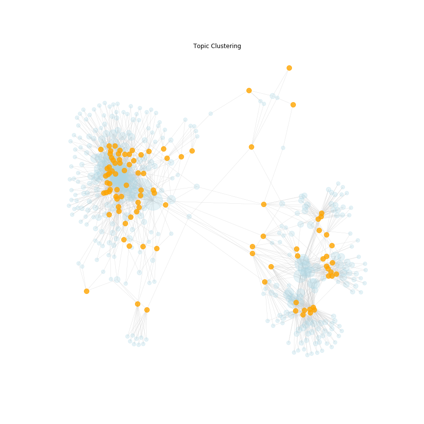

scraping news & topic extraction & article clustering according to topic
================

Work in progress

- scraping news page (done)
- automatically append to data base and clean articles (done)
- automatically extract topics out of article text (done) and save all extracted information (done)
- visualize articles according to topics (version 1: done)
- animate how clustering works (version 1: done)

more work to be done:
- better visualize
- interactive?
- how can I automate topic colouring?

## visualize article clustering
- ORANGE = articles
- LIGHT BLUE = topic

Only a subset of 100 articles are used for this visualization.
Kind of visualization: topics and articles connected with "springs"

## animation of article clustering
